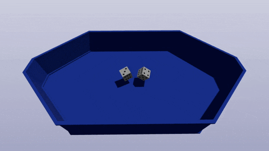

# 🎲 Target Dice Demo

An interactive 3D dice roll demo.  
You can **choose the number of dice and set the exact values that should appear**, then hit **Play** to see a realistic roll animation where the dice land on the requested numbers.  

---

## ✨ Features

- Select number of dice.  
- Determine the result of each die roll.
- **Play** triggers a physics-based roll animation.  
- Guaranteed results matching the chosen values.  

---

## ⚙️ Tech Stack

- **Next.js**
- **TailwindCSS**
- **Three.js**
- **Cannon.js**
- **WebWorker**

---

## Links

- [uikit](https://uikit-peach.vercel.app)
- [GitHub](https://github.com/belousovjr/target-dice-demo)
